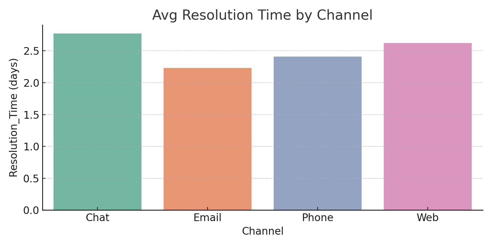
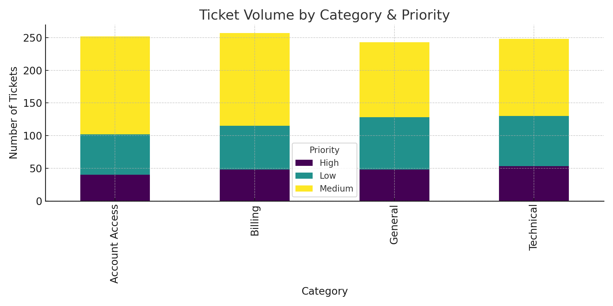
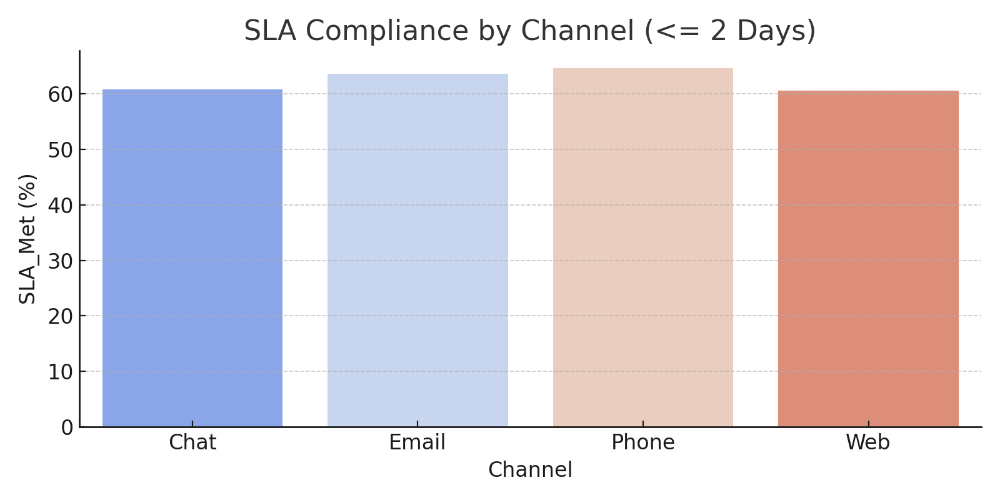
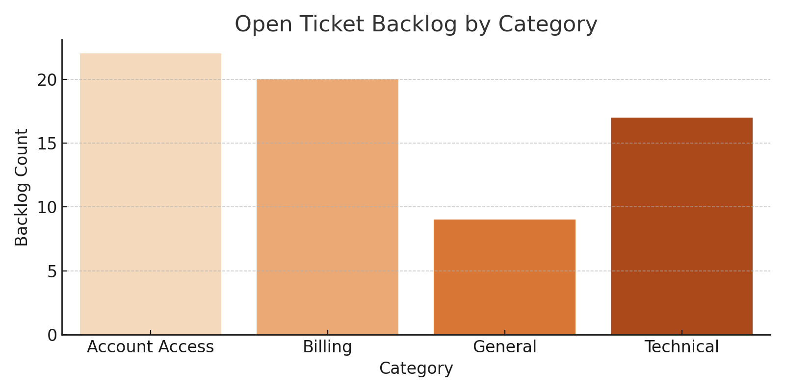

# Customer Support KPI Dashboard (SQL + Python)

A dashboard-driven analysis of customer support ticket data. This project simulates ticket flows across channels, agents, and issue types, and calculates core support KPIs using SQL-style logic and Python visualizations.

---

## Repository Name

**customer-support-kpi-dashboard**

---

## Objective

- Track average resolution time by channel and category  
- Calculate SLA compliance and backlog metrics  
- Analyze ticket volume by issue priority  
- Deliver stakeholder-ready insights using Python and dashboard visuals

---

## Tools Used

- Python (Pandas, Matplotlib, Seaborn)
- SQL-style aggregations
- Jupyter Notebook
- Simulated support ticket dataset

---

## Key Metrics Calculated
- **Avg Resolution Time (by channel)**  
- **Ticket Volume by Category & Priority**  
- **SLA Compliance Rate** (within 2 days)  
- **Open Backlog Count by Category**

---

## Files Included

- `Support KPI Dashboard.ipynb` – Full analysis notebook  
- `customer_support_tickets.csv` – Simulated support ticket data  
- PNG Visuals:
  - `avg_resolution_time_channel.png`
  - `ticket_volume_category_priority.png`
  - `sla_compliance.png`
  - `ticket_backlog_category.png`

---

## Sample Visuals

### 1. Avg Resolution Time by Channel

### 2. Ticket Volume by Category & Priority

### 3. SLA Compliance by Channel

### 4. Open Ticket Backlog by Category

---

## Dataset Source

The dataset was synthetically generated to represent realistic support operations.  
It includes 1,000 tickets spanning categories, agents, priorities, and resolution times.

---

